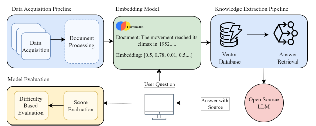

# Towards Accurate AI-Driven QA: A Retrieval-Augmented Model.

## Authors

***Mohammed Rakibul Hasan***

---

## Abstract
Recent advances in large language models (LLMs) have significantly enhanced their ability to perform question-answering tasks. However, these models face challenges such as hallucinations, misinformation, and inconsistencies, particularly when applied to domains with limited training data. For sensitive topics like history, it is crucial to develop LLM systems that are both reliable and accurate. While fine-tuning LLMs on diverse datasets can improve domain-specific performance, this approach is often resource-intensive and costly.

In this project, we introduce **ItihashQA**, a publicly available, conversational AI-driven retrieval question-answering system specifically trained in the historical context. Our approach combines the Stable Vicuna LLM with expert-verified historical datasets, enabling the generation of precise and contextually appropriate responses.

We conducted an extensive evaluation of ItihashQA against other LLMs, including ChatGPT, Vicuna, and Koala. This evaluation involved extensive human assessments of questions of varying complexity levels. Responses were rated on a Likert scale from 1 to 5, with ItihashQA consistently demonstrating high accuracy across all difficulty levels. The results indicate that ItihashQA provides accurate and high-quality answers.

By utilizing open-source LLM and external data sources, ItihashQA advances beyond existing RAG and QA models by combining a highly targeted, verified dataset with resource-efficient yet powerful model architecture and sophisticated prompt engineering, a level of specificity that general RAG systems might lack.

---

## Workflow

The following diagram illustrates the overall workflow of the ItihashQA system:

---

## Results

The findings from the evaluation reveal that **ItihashQA** emerged as the top performer, achieving the highest score in easy, medium, and hard questions, with an overall accuracy of **92.00%**. Here’s a comparison with other models:

| Model        | Easy Score | Medium Score | Hard Score | Overall Accuracy |
|--------------|------------|--------------|------------|------------------|
| ItihashQA    | 4.65       | 4.50         | 4.70       | 92.00%          |
| BARD         | 4.45       | 4.35         | 4.40       | 87.00%          |
| ChatGPT      | 4.30       | 4.10         | 4.25       | 84.33%          |
| Vicuna-13B   | 3.90       | 3.80         | 4.00       | 78.33%          |
| Llama        | 3.20       | 3.10         | 3.25       | 60.33%          |

*Table I: Performance Comparison across Models*

---

## Discussion

Our study presents a RAG-based system designed to generate stable and accurate domain-specific answers. **ItihashQA**’s superior performance on lower parameters is inherently valuable, as it provides high-quality responses without requiring extensive computational resources.

Upon comparing model parameters (as shown in **Table II**), we observe that ChatGPT (175B) and BARD (137B) have significantly higher parameter counts. Meanwhile, ItihashQA and other models like Vicuna possess only 13B parameters. This balance of lightweight architecture and high output quality suggests that ItihashQA is highly scalable and adaptable for other specialized domains. 

Maintaining a lower parameter count, our model offers a practical, cost-effective solution for developing reliable QA systems in resource-constrained settings.

---

### Figures

| Model         | Parameters           |
|---------------|----------------------|
| ChatGPT       | 175B parameters      |
| BARD          | 137B parameters      |
| ItihashQA     | 13B parameters       |
| Vicuna-13B    | 13B parameters       |

---

## Conclusion

The scalability and adaptability of ItihashQA suggest significant potential for its application in other specialized domains. With its lower parameter count, ItihashQA serves as a practical, cost-effective solution for building reliable QA systems in resource-constrained environments.

---

## References
- [1] Stable Vicuna LLM Documentation
- [2] Evaluation Metrics and Likert Scale
- [3] Previous Work in RAG and QA Models
